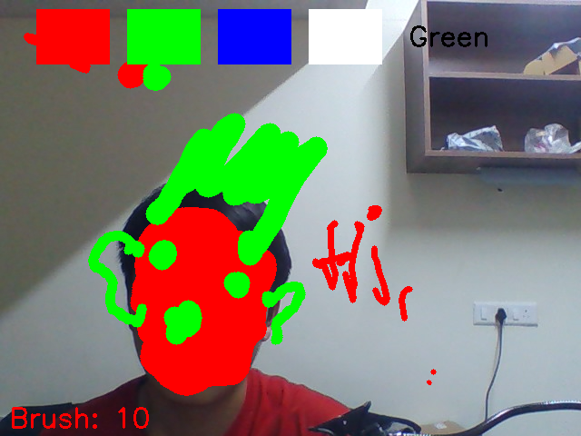
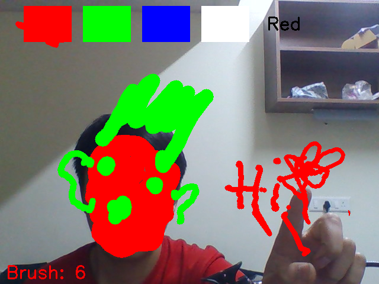

# Air Canvas 
Draw in the air using hand gestures!

This project uses your webcam, computer vision, and hand tracking (via MediaPipe) to create an interactive air-drawing application where you can select colors, draw, erase, adjust brush thickness, and save your artwork — all with just your hand movements.

## Demo

## Features
Draw using your index finger.
- Select colors by moving your hand to the color menu.
- Eraser mode for corrections.
- Adjust brush thickness by changing the number of fingers shown.
- Save your artwork by pressing the s key.
- Clear the canvas with the c key.
- Exit the application by pressing the q key.

## How It Works
- One Finger Up (Index) → Draw.
- Two Fingers Up (Index + Middle) → Select color from the top menu.
- Three Fingers Up → Increase brush thickness.
- Four Fingers Up → Decrease brush thickness.

## Requirements
- Python 3.x
- Webcam
- Libraries:
- OpenCV
- MediaPipe
- NumPy

## Controls
### Key	Action
- q	Quit the application
- c	Clear the canvas
- s	Save the current screen (with canvas)

## Credits
- MediaPipe by Google for real-time hand tracking.
- OpenCV for computer vision operations.